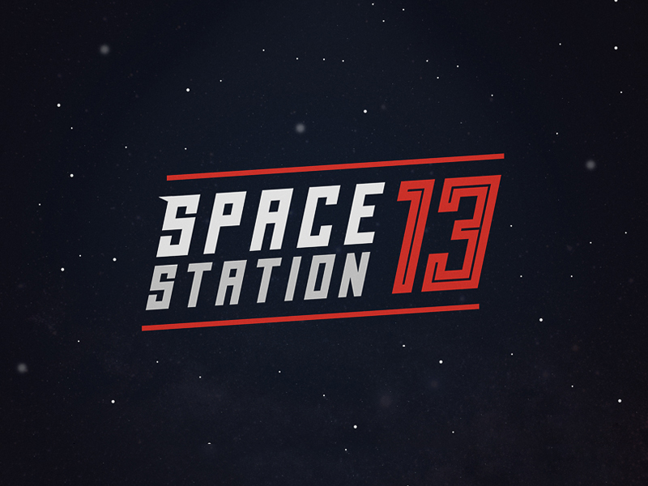

<p align="center">
    
  <h2 align="center">
    <a href="https://github.com/frosty-dev/white-dream-main/">«White Dream» project</a> Server Control Bot
  </h2>
  <p align="center">🤖 Helps with server that runs on <a href="http://byond.com/">BYOND</a> <a href=" https://github.com/topics/byond?l=dm">DM Lang</a>.
  </p>
</p>

<p align="center">
  <a href="https://forthebadge.com">
     
  </a>
  <a href="https://forthebadge.com">
     
  </a>
  <br>
  <a href="https://code.visualstudio.com/">
     
  </a>
  <a href="">
     
  </a>
  <a href="https://crowdin.com/project/wdbot">
     
  </a>
  <a href="https://github.com/Gesugao-san/wdbot/issues?q=is%3Apr+is%3Aclosed">
     
  </a>
  <a href="https://opensource.org/licenses/MIT">
     
  </a>
  <br>
  <a href="https://GitHub.com/Gesugao-san/wdbot/network/">
     
  </a>
  <a href="https://GitHub.com/Gesugao-san/wdbot/stargazers/">
     
  </a>
</p>


<span style="height: 60px; background-color:currentColor" width="120px">
  <object data="http://www.byond.com/download/version.txt" type="text/plain" width="120px" height="60px" style="background-color: currentColor">
    <a href="http://www.byond.com/download/version.txt" style="color: black">No Support?</a>
  </object>
</span>

<span style="height: 60px; background-color:currentColor" width="120px">
  <iframe src="http://www.byond.com/download/version.txt" frameborder="1" width="120px" height="60px" style="background-color: currentColor"></iframe>
</span>

<br>

<span style="background-color: currentColor">
  <span style="color: black">
  Text here
  </span>
</span>


# Space Station 13 servers control bot

This bot greatly simplifies the hosting of game servers. It is not necessary, but without it, the life of the host will be clearly more difficult.
Runs on Linux, using Node.js® as engine and using Discord as input.

## How to use this
1. Install the BYOND if it is not installed:

Find out the latest version: https://www.byond.com/download/

* At the time of writing, the current version is 512.1488

Download the installation package:

```bash
wget http://www.byond.com/download/build/512/512.1471_byond_linux.zip
unzip 512.1471_byond_linux.zip
rm 512.1471_byond_linux.zip
cd byond/
```

Install it:

```bash
sudo make install
```

And test it:

```bash
DreamDaemon
```

The help information is displayed - the BYOND is installed.

2. Copy `h.js` and `s1.json` files into some dir, it doesn't matters what dir.
3. Install all dependencies by issuing this `npm i discord.js shelljs chokidar log-timestamp is-root`.
4. Edit `h.js` and `s1.json`(you can create multiple servers) as your server(s) need. The main things you need to edit is on top of the file.
5. Create dirs for `production` and `repos`. In the `repos` dir clone your server and name his folder like `repo_SERVERNAME`.
6. Replace your `deploy.sh` in the server repo with ours.
7. Now run `node h.js` and that is.
8.  forgot to install . Do it by `sudo apt install screen`. Install the ёё if it is not installed:

Also use this, if your bot crashes sometimes: https://www.npmjs.com/package/forever

## And yes, you need to compile all libs and place in the server prod dir
Do it, lazy man.
